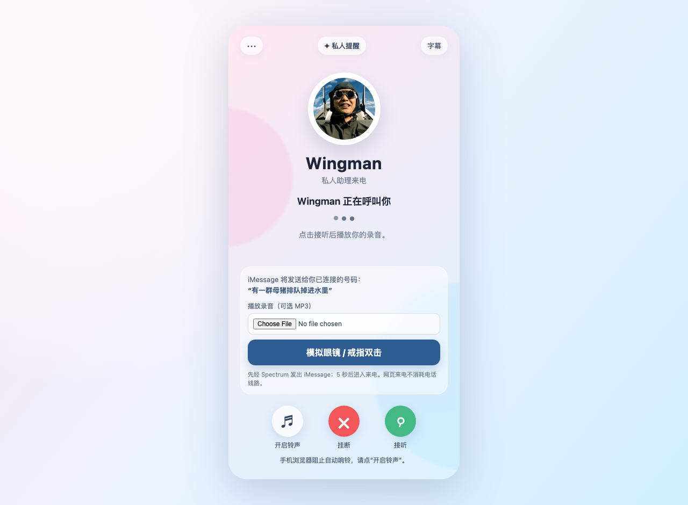
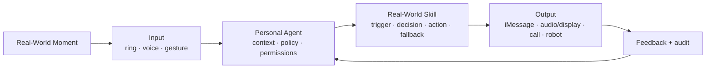

# SNAKE1

**Wake your Personal Agent from the real world. Let it return to the real world and help.**

[中文](README.zh.md) · [Live UI preview](https://sgysy.github.io/AdvantureX/) · Submission branch: `final`

SNAKE1 is a platform that lets a Personal Agent be triggered by physical-world
signals and act through authorized real-world tools. A ring gesture, a short
voice window, or a deliberate motion becomes an **Input**. The Agent interprets
the moment, checks the owner and permission boundary, invokes a reusable
**Real-World Skill**, and returns through iMessage, a private audio/display
channel, a phone workflow, or a robot.

> A screen-bound Agent waits for a prompt. SNAKE1 is there for the few seconds
> when taking out a screen is exactly what you cannot do.

<p align="center">
  
</p>

<p align="center"><em>Wingman is SNAKE1's first Real-World Skill: message first, rescue call second.</em></p>

## The 30-second demo

The first Skill is intentionally simple enough to understand before we explain
the platform:

1. A date is obviously going nowhere, but leaving directly feels awkward.
2. The user makes a trained gesture on a Zilo ring—no phone, no visible typing.
3. The local recognizer accepts only an allowlisted gesture above the confidence
   threshold; the backend checks its owner-only route and duplicate-trigger
   guard.
4. SNAKE1 sends the configured rescue message through Photon Spectrum/iMessage.
5. Ten seconds later, the mobile demo rings so the user can leave naturally.

The incoming-call screen is an honest browser-based visual/audio demo, not a
disguised PSTN call. A separate, opt-in Twilio adapter can place a real call only
after explicit confirmation.

**Chinese easter egg:** 现实里没有吕子乔，但你可以随身带一个 Snake。

## One platform, not one ring

The ring is only an endpoint. The product is the closed loop:



The four product objects are deliberately small:

| Object | Responsibility | Current example |
|---|---|---|
| **Agent** | Understand intent, enforce policy, plan an authorized action | FastAPI control plane + StepFun planner |
| **Inputs** | Wake the Agent privately with minimal friction | Zilo BLE/IMU gesture, Even ring, short voice turn |
| **Skills** | Package trigger, decision, actions, timing, cancellation, and fallback | Discreet Exit, Private Coach, Robot Icebreaker |
| **Outputs** | Return to the physical world through user-approved tools | Photon iMessage, mobile call UI, Twilio, DimOS/Go2 |

## Three independent Skills

| Priority | Skill | Demonstrates | Repository status |
|---|---|---|---|
| **P0** | **Discreet Exit** | Ring → Agent → message → delayed call workflow | End-to-end code present; Photon/Twilio require private credentials |
| **P1** | **Private Coach** | Explicit short listening window → one concise private suggestion | Real-time capture/analysis is implemented on the Even prototype; generic voice-turn API is ready for a Future Intelligence/viaim adapter |
| **P2** | **Robot Icebreaker** | Agent proposal → user confirmation → physical action | DimOS MCP + real Go2 adapter present, intentionally limited to stationary greeting/neutral pose/emergency stop |

P0 does not depend on the headset or robot. P1 never means continuous
listening. P2 does not expose navigation, raw velocity, following, jumping, or
dancing in this submission.

## Selected sponsor tracks

We selected the four tracks that strengthen the same loop instead of inventing
four unrelated demos:

| Track | Role in SNAKE1 | What is implemented |
|---|---|---|
| **Photon** | Agent-native real-world messaging output | Spectrum iMessage Agent, outbound DM bridge, inbound owner commands, cancellation and delay |
| **弦指科技 · Zilo** | Covert physical input | BLE ring connection, six-axis stream processing, HMM gesture models, confidence gate, backend bridge |
| **Dimensional** | Embodied output | StepFun planning → one-time confirmation → allowlisted DimOS MCP tools for Unitree Go2 |
| **未来智能 · Future Intelligence** | Private, voice-first Agent interface | Device-agnostic short-turn contract and Rescue/Coach dialogue; viaim-specific device transport remains the adapter to bind |

The last row is intentionally labeled adapter-ready rather than complete. The
repository does not claim a sponsor-device integration that is not present.

## What works today

| Capability | Evidence in this repository | Runtime mode |
|---|---|---|
| Zilo gesture input | BLE transport, recorded samples, pretrained HMM models, local bridge, 6 tests | Real hardware when paired |
| Photon messaging | Spectrum Agent and control bridge; owner-only inbound commands | Live with Photon credentials, explicit demo mode without them |
| Rescue orchestration | Scheduling, message-before-call timing, cancellation, timeout/status, SQLite audit trail | Local |
| Real-time private coaching | 15-second capture lifecycle, StepFun realtime analysis, allowlisted suggestions, fail-closed relay | Real Even G2/R1 prototype |
| Go2 physical output | StepFun tool planning, stationary safety policy, single-use confirmation, DimOS MCP client | Real robot when connected |
| Call output | Mobile incoming-call UI plus separately configured Twilio adapter | Browser demo by default; PSTN opt-in |

The repository also keeps a normalized hardware-event contract so another
ring, earbud, glasses device, or gesture sensor can become an Input without
receiving Photon credentials.

## Architecture

```text
Zilo BLE / Even ring / voice turn
              │
              ▼
      normalized owner event
              │
              ▼
  SNAKE1 FastAPI control plane ─── SQLite audit + cancellation
        │          │
        │          └── StepFun planner ── confirmation gate ── DimOS MCP ── Go2
        │
        ├── Photon Spectrum ── iMessage
        ├── mobile call state ── browser UI
        └── explicit Twilio adapter ── PSTN call
```

Important boundaries:

- Hardware adapters send normalized events; they never contain Photon secrets.
- The Even relay uses an authenticated public first hop and a separate
  loopback-only shared secret for Relay → Wingman.
- Zilo recognition runs beside the BLE ring and reaches an owner-only local
  endpoint.
- Non-emergency Go2 actions require a single-use `action_id`. Emergency stop is
  the only action allowed without confirmation.
- Demo mode never reports a simulated message or browser call as a real
  delivery.

## Quick start: credential-free demo

Requirements: Python 3.11+ and Node.js 22+.

```bash
git clone --branch final https://github.com/SGYSY/AdvantureX.git
cd AdvantureX

python3 -m venv .venv
source .venv/bin/activate
pip install -r requirements.txt

cp .env.example .env
uvicorn app.main:app --app-dir backend --reload
```

Open:

- Dashboard: <http://127.0.0.1:8000>
- Mobile rescue screen: <http://127.0.0.1:8000/mobile>
- Static UI preview: <https://sgysy.github.io/AdvantureX/>

With empty provider credentials, message delivery remains clearly marked as
`demo`; orchestration, timing, cancellation, UI, and audit behavior still run
locally.

## Real integration entry points

- **Photon/iMessage:** [`snakeone/README.md`](snakeone/README.md)
- **Zilo ring:** [`zilo/hmm_gesture/README.md`](zilo/hmm_gesture/README.md)
- **Real-time glasses/ring relay:** [`hardware/even-relay/README.md`](hardware/even-relay/README.md)
- **DimOS/Unitree Go2:** [`hardware/go2/README.md`](hardware/go2/README.md)
- **Hardware event contract:** [`docs/hardware-event-contract.md`](docs/hardware-event-contract.md)

Core API surface:

| Endpoint | Purpose |
|---|---|
| `POST /api/v1/hardware/zilo` | Locally recognized Zilo HMM gesture |
| `POST /api/v1/events/zilo` | Normalized ring/voice gateway |
| `POST /api/v1/hardware/even` | Authenticated loopback relay from Even hardware |
| `POST /api/v1/voice/turn` | Short Rescue/Coach voice turn |
| `POST /api/v1/agent/turn` | Plan an allowlisted physical action |
| `POST /api/v1/agent/confirm` | Execute one exact, single-use Go2 action |
| `POST /api/v1/photon/inbound` | Owner commands received from iMessage |

## Safety and privacy

“Always available” does not mean “always listening.”

- Skills are created, authorized, and deliberately triggered by the user.
- P1 captures only a short, explicit window and discards partial or expired
  sessions.
- The configured message recipient must be the owner or a pre-consented thread.
- Default rescue copy is fictional and non-alarming; it avoids medical,
  disaster, police, and family-crisis impersonation.
- Calling is disabled until all required credentials and a public HTTPS audio
  URL are configured, and the dashboard asks for confirmation.
- Secrets, phone numbers, robot keys, local databases, and generated artifacts
  stay in ignored local files.

## Verification

Current `final` result: **120 automated tests passing**, both Photon Spectrum
TypeScript agents type-checking, and the Even hardware client production build
completing.

```bash
# Backend, orchestration, Go2 policy, launcher, and security boundaries
PYTHONPATH=backend .venv/bin/python -m pytest backend/tests -q

# Mobile call state
node --test backend/tests/mobile_ui.test.mjs

# Photon Spectrum TypeScript agents
(cd snakeone && npm ci && npx tsc --noEmit)
(cd photon-bridge && npm ci && npm run check)

# Even hardware client, realtime capture, relay, and production build
npm ci --prefix hardware/even-relay
npm test --prefix hardware/even-relay
npm run test:tools --prefix hardware/even-relay
npm run build --prefix hardware/even-relay

# Zilo BLE/HMM pipeline
.venv/bin/pip install -r zilo/hmm_gesture/requirements.lock
PYTHONPATH=zilo/hmm_gesture .venv/bin/python -m pytest zilo/hmm_gesture/tests -q
```

## Repository map

```text
backend/                FastAPI control plane, persistence, adapters, tests
snakeone/               Photon Spectrum iMessage Agent
photon-bridge/          Minimal outbound/inbound Spectrum bridge
zilo/hmm_gesture/       Zilo BLE + IMU/HMM recognition and trained samples
hardware/even-relay/    Even G2/R1 input and short real-time coach
hardware/go2/           Confirmation-gated DimOS/Unitree Go2 tools
hardware/shared/        Hardware-agnostic event boundary
docs/                   GitHub Pages mobile call UI
scripts/                Safe integrated launcher and configuration helpers
```

## Product boundary

SNAKE1 is not a ring, an earbud, or a robot dog. It is the permissioned layer
that lets a Personal Agent notice a user-declared real-world moment and safely
return through the right physical tool.

**Real world wakes the Agent. The Agent comes back to help.**
