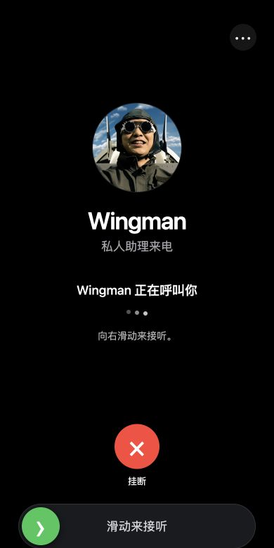
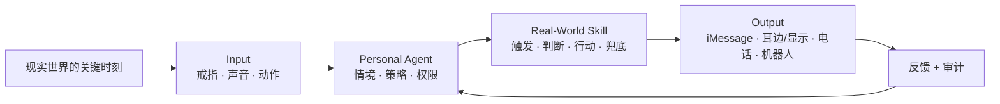

# SNAKE1

**现实世界唤醒 Agent，Agent 回到现实世界帮你。**

[English](README.md) · [在线界面预览](https://sgysy.github.io/AdvantureX/) · 提交分支：`final`

SNAKE1 是一个平台原型，目标是让 Personal Agent 能被现实触发，并通过被授权
的现实工具采取行动。一次戒指手势、一段短时声音或一个明确动作成为 **Input**；Agent
理解当下时刻、检查用户身份与权限、调用可复用的 **Real-World Skill**。目标
Output 可以是 iMessage、私密音频/显示、电话流程或机器人；当前真正形成闭环的
Demo 只有消息/来电路径。

> 传统 Agent 很聪明，却只能等你打开聊天框。SNAKE1 解决的是那几秒钟：
> 你最需要帮助，却恰好最不方便掏出屏幕的时候。

<p align="center">
  
</p>

<p align="center"><em>Wingman 是 SNAKE1 的第一个 Real-World Skill：消息先到，救场来电随后出现。</em></p>

## 30 秒看懂 Demo

我们先演一个不需要解释技术名词的真实瞬间：

1. 一场约会明显聊不下去，但直接离开又很尴尬。
2. 用户在桌下做出训练过的 Zilo 戒指手势，不掏手机、不打字。
3. 本地识别器只接受白名单内且超过置信度阈值的手势；后端继续检查
   owner-only 本地入口和重复触发保护。
4. SNAKE1 通过 Photon Spectrum / iMessage 发来预设救场消息。
5. 十秒后，手机演示页出现 Wingman 来电，用户顺势自然离场。

来电页面是明确标注的浏览器视觉/音频 Demo，不伪装成真实运营商电话。
若用户另行配置 Twilio，系统也可以在明确确认后拨打真实电话。

**中文彩蛋：现实里没有吕子乔，但你可以随身带一个 Snake。**

## 产品不是戒指，而是一条闭环

戒指只是 Agent 的一个入口。SNAKE1 的目标产品闭环是：



产品界面和系统结构都只围绕四个对象：

| 对象 | 职责 | 当前例子 |
|---|---|---|
| **Agent** | 理解意图、执行策略、规划被授权的动作 | FastAPI 控制面 + StepFun Planner |
| **Inputs** | 用低摩擦、私密方式唤醒 Agent | Zilo BLE/IMU 手势、Even 戒指、短时语音 |
| **Skills** | 打包触发、判断、行动、时序、取消与失败兜底 | 体面溜走、耳边僚机、机械狗破冰 |
| **Outputs** | 通过用户授权的工具返回现实 | Photon iMessage、手机来电 UI、Twilio；DimOS/Go2 目前只是实验目标 |

## 三个彼此独立的 Skill

| 优先级 | Skill | 证明什么 | 仓库状态 |
|---|---|---|---|
| **P0** | **体面溜走** | 戒指 → Agent → 消息 → 延迟来电流程 | 完整代码已在仓库；Photon/Twilio 实发需要私密凭据 |
| **P1** | **耳边僚机** | 明确开启的短时收音 → 一句私密建议 | Even 原型单独完成了实时采集与分析；通用语音接口可继续绑定未来智能/viaim 设备 |
| **P2** | **机械狗破冰** | Agent 提议 → 用户确认 → 物理行动 | **尚未完成端到端接入。** 当前机器狗演示是人工遥操；仓库中只有未经真机闭环验证的集成脚手架 |

P0 不依赖耳机或机械狗。P1 不做全天持续监听。

> **当前硬件实况：Even 眼镜链路和 Dimensional/Go2 链路没有接起来。**
> 目前没有 Even 事件能够触发 Go2 动作，机器狗也没有作为自主 SNAKE1 Agent
> 运行；现场是人类遥操。`hardware/go2/` 记录的是尝试中的下一步，不是已经
> 跑通的 Demo。

## 选择的四个赛道

我们只报能强化同一条现实闭环的四个赛道，而不是临时拼出四个无关项目：

| 赛道 | 在 SNAKE1 中的角色 | 已实现内容 |
|---|---|---|
| **Photon** | Agent 原生的现实消息 Output | Spectrum iMessage Agent、主动私聊、owner 消息指令、取消与延后 |
| **弦指科技 · Zilo** | 隐蔽的现实 Input | BLE 戒指连接、六轴数据处理、HMM 手势模型、置信度门槛、后端桥接 |
| **Dimensional** | 计划中的具身 Output | 当前现场能力是人工遥操 Go2；StepFun/DimOS 代码仍是实验性脚手架，尚未验证 Even → Agent → 机器狗闭环 |
| **未来智能 · Future Intelligence** | 私密、Voice-first 的 Agent 入口 | 已实现短时语音协议与 Rescue/Coach 对话；viaim 专用设备传输层仍需绑定 |

Dimensional 与未来智能两项明确写为“未完成”或“接口就绪”，而不是假装完成
仓库里不存在的赞助方设备集成。这能让评委看清平台扩展性，也保留技术可信度。

## 今天真实能跑什么

| 能力 | 仓库证据 | 运行方式 |
|---|---|---|
| Zilo 手势输入 | BLE 传输、真实采样、预训练 HMM、本地桥接、6 个测试 | 配对后连接真实硬件 |
| Photon 消息 | Spectrum Agent、主动/被动桥接、owner-only 指令 | 有 Photon 凭据时实发；无凭据时明确进入 Demo |
| 救场编排 | 消息/来电时序、取消、状态、重复触发保护、SQLite 审计 | 本地运行 |
| 实时私密建议 | 15 秒采集生命周期、StepFun 实时分析、固定建议白名单、fail-closed Relay | 独立的 Even G2/R1 原型；未连接 Go2 |
| Dimensional / Go2 | 人工遥操 Demo，以及实验性的 StepFun/DimOS Adapter 脚手架 | **未连接 Even，也未验证为 Agent 自主 Output** |
| 电话 Output | 手机来电 UI + 独立 Twilio Adapter | 默认浏览器 Demo；PSTN 需主动配置 |

仓库还定义了统一硬件事件协议，因此新的戒指、耳机、眼镜或动作传感器可以
成为 Input，同时永远不需要拿到 Photon 凭据。

## 当前架构与目标架构

```text
已验证的软件 / Demo 路径
Zilo 或 Even 原型 ──► SNAKE1 控制面 ──► Photon / 手机来电 UI

当前机器狗路径
人类操作者 ──► 遥控 ──► Go2

目标路径——尚未完成
Even 眼镜 ──► SNAKE1 Agent ──► 权限确认 ──► DimOS ──► Go2
```

关键边界：

- 硬件 Adapter 只发送标准化事件，永远不携带 Photon Secret。
- Even Relay 的公网第一跳需要 Token；Relay → Wingman 使用另一份
  loopback-only Shared Secret。
- Zilo 手势在 BLE 戒指旁本地识别，只能访问 owner-only 本地入口。
- 实验性 Go2 代码定义了一次性 `action_id` 与急停策略，但软件策略测试不能
  证明 Even 到 Go2 的物理链路已经跑通。
- Demo Mode 不会把模拟消息或浏览器来电汇报成真实投递。

## 零凭据快速启动

环境要求：Python 3.11+、Node.js 22+。

```bash
git clone --branch final https://github.com/SGYSY/AdvantureX.git
cd AdvantureX

python3 -m venv .venv
source .venv/bin/activate
pip install -r requirements.txt

cp .env.example .env
uvicorn app.main:app --app-dir backend --reload
```

打开：

- 控制面板：<http://127.0.0.1:8000>
- 手机救场页面：<http://127.0.0.1:8000/mobile>
- 静态界面预览：<https://sgysy.github.io/AdvantureX/>

当 Provider 凭据为空时，消息投递会明确显示为 `demo`；编排、时序、取消、
界面和审计仍然可以在本地完整运行。

## 已实现与实验性入口

- **Photon / iMessage：** [`snakeone/README.md`](snakeone/README.md)
- **Zilo 戒指：** [`zilo/hmm_gesture/README.md`](zilo/hmm_gesture/README.md)
- **实时眼镜/戒指 Relay：** [`hardware/even-relay/README.md`](hardware/even-relay/README.md)
- **实验性 DimOS / Unitree Go2 脚手架：** [`hardware/go2/README.md`](hardware/go2/README.md)
- **硬件事件协议：** [`docs/hardware-event-contract.md`](docs/hardware-event-contract.md)

核心 API：

| Endpoint | 作用 |
|---|---|
| `POST /api/v1/hardware/zilo` | 接收本地识别后的 Zilo HMM 手势 |
| `POST /api/v1/events/zilo` | 标准化戒指/语音入口 |
| `POST /api/v1/hardware/even` | 接收带认证的 Even 本地 Relay |
| `POST /api/v1/voice/turn` | 一次短时 Rescue/Coach 语音轮次 |
| `POST /api/v1/agent/turn` | 实验性白名单物理动作规划协议 |
| `POST /api/v1/agent/confirm` | 实验性确认协议；尚未完成真机端到端验证 |
| `POST /api/v1/photon/inbound` | 接收 owner 从 iMessage 发来的控制指令 |

## 安全与隐私

“随时待命”不等于“随时监听”。

- Skill 由用户创建、授权并主动唤起。
- P1 只采集一次明确开启的短窗口；不完整或超时会话会被丢弃。
- 消息目标必须是用户本人或预先同意的 Thread。
- 默认救场内容使用虚构、无恐慌的理由，不冒充医疗、灾害、警察或亲属危机。
- 真实电话默认关闭；只有凭据与公网 HTTPS 音频地址齐全，并经用户确认后启用。
- Secret、手机号、机器狗 Key、本地数据库和生成文件都保留在 Git 忽略的本地文件中。

## 验证

当前 `final` 结果：**120 个自动化测试通过**，两个 Photon Spectrum TypeScript
Agent 均通过类型检查，Even 硬件客户端生产构建完成。这些测试验证的是软件
协议，**不能证明 Even 已经触发 DimOS/Go2，也不能证明机器狗已自主行动。**

```bash
# 后端、编排、Go2 策略、Launcher 与安全边界
PYTHONPATH=backend .venv/bin/python -m pytest backend/tests -q

# 手机来电状态
node --test backend/tests/mobile_ui.test.mjs

# Photon Spectrum TypeScript Agent
(cd snakeone && npm ci && npx tsc --noEmit)
(cd photon-bridge && npm ci && npm run check)

# Even 硬件客户端、实时采集、Relay 与生产构建
npm ci --prefix hardware/even-relay
npm test --prefix hardware/even-relay
npm run test:tools --prefix hardware/even-relay
npm run build --prefix hardware/even-relay

# Zilo BLE/HMM
.venv/bin/pip install -r zilo/hmm_gesture/requirements.lock
PYTHONPATH=zilo/hmm_gesture .venv/bin/python -m pytest zilo/hmm_gesture/tests -q
```

## 仓库结构

```text
backend/                FastAPI 控制面、持久化、Adapter 与测试
snakeone/               Photon Spectrum iMessage Agent
photon-bridge/          最小主动/被动 Spectrum Bridge
zilo/hmm_gesture/       Zilo BLE + IMU/HMM 识别与训练样本
hardware/even-relay/    Even G2/R1 Input 与短时实时僚机
hardware/go2/           实验性、未完成真机闭环的 DimOS / Unitree Go2 脚手架
hardware/shared/        与具体硬件无关的事件边界
docs/                   GitHub Pages 手机来电 UI
scripts/                实验性启动与配置助手
```

## 产品边界

SNAKE1 不是戒指、耳机或机械狗。它是一个权限明确的中间层：让 Personal
Agent 看见用户主动声明的现实瞬间，再通过最合适的物理工具安全地回来帮你。

**现实世界唤醒 Agent，Agent 回到现实世界帮你。**
